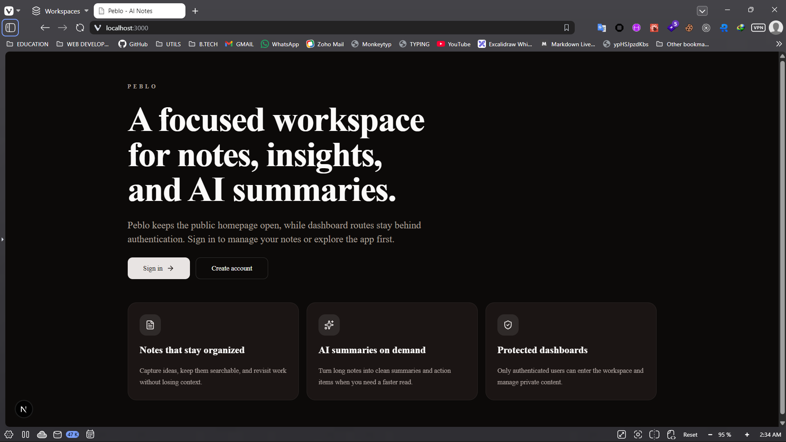
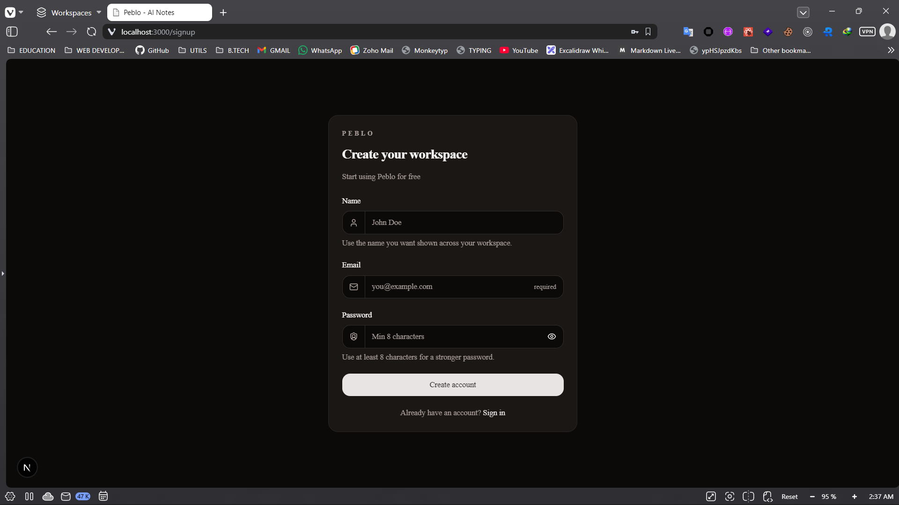
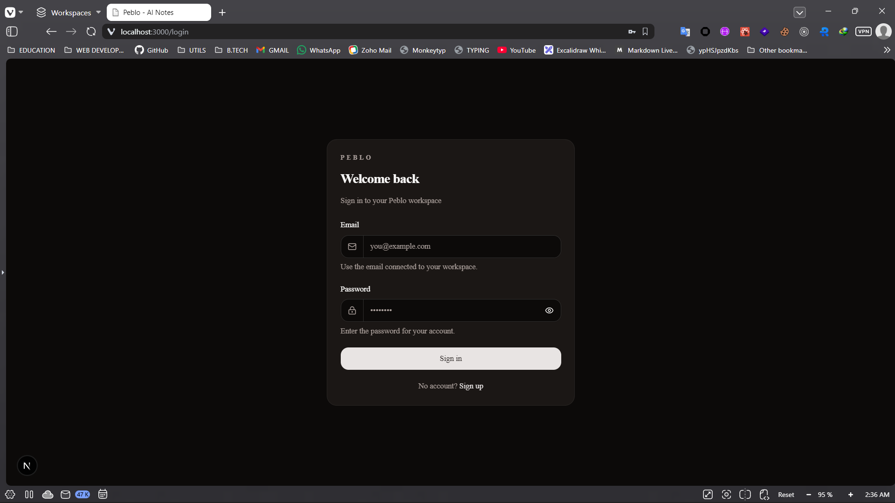
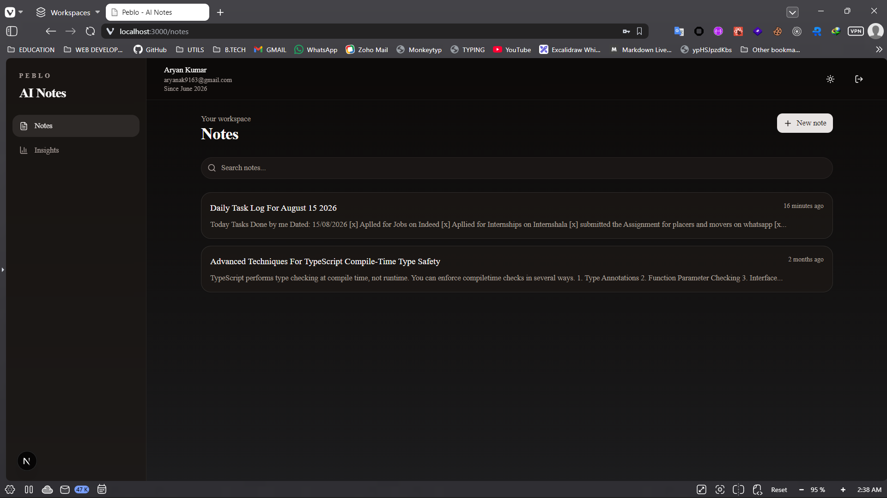
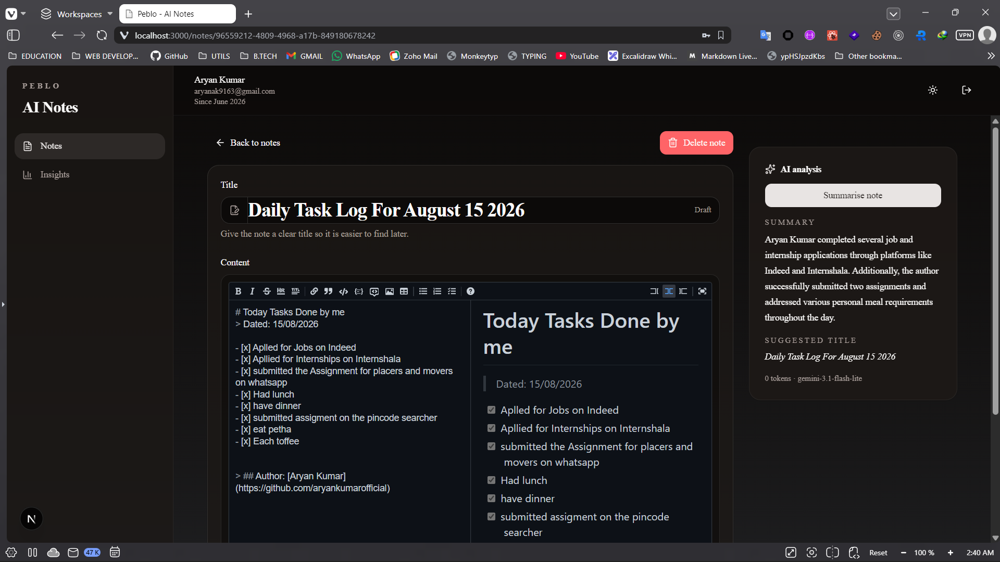

# Peblo — AI Notes

> A focused AI-powered workspace for writing, organizing, analyzing, and sharing notes.

**Peblo AI Notes** is a full-stack notes application developed as part of the **Peblo engineering assignment**.

The project combines a modern Next.js frontend with a dedicated Express API, PostgreSQL, Drizzle ORM, shared TypeScript packages, authentication, note management, analytics, and AI-powered note analysis.

---

## ✨ Features

### 📝 Notes

- Create, edit, and delete notes
- Rich Markdown-based note editor
- Live Markdown preview
- Automatic save state
- Search notes by title and content
- Archive notes
- Organize notes using tags
- Recently updated notes

### 🤖 AI-Powered Analysis

Analyze notes using an integrated AI layer.

The AI can:

- Generate concise summaries
- Extract action items
- Suggest improved note titles
- Stream analysis results using Server-Sent Events (SSE)
- Persist generated AI results for later access

The AI layer is implemented as a shared workspace package, allowing the API to remain independent from the underlying model provider.

### 📊 Insights

The workspace provides analytics including:

- Total notes
- AI generations
- Archived notes
- Unique tags
- Weekly activity
- Recently edited notes
- Tag usage

### 🔐 Authentication & Security

- User registration and login
- Password hashing with Argon2
- JWT-based authentication
- HTTP-only cookie-based session handling
- Protected dashboard routes
- User-scoped database queries
- Request validation with Zod
- Centralized API error handling

### 🔗 Note Sharing

Notes can be made publicly accessible through generated share identifiers without exposing private workspace data.

### 🐳 Development & Deployment

- pnpm workspaces
- Turborepo
- Docker Compose support
- TypeScript across the stack
- Shared packages for database, schemas, AI, UI, and configuration
- API health endpoint
- Separate frontend and backend services

---

## 🏗️ Architecture

```text
                         ┌─────────────────────┐
                         │      Next.js        │
                         │       Web App       │
                         │                     │
                         │  Auth / Notes /     │
                         │  Insights / Editor  │
                         └──────────┬──────────┘
                                    │
                              HTTP / SSE
                                    │
                                    ▼
                         ┌─────────────────────┐
                         │      Express API    │
                         │                     │
                         │ Auth / Notes /      │
                         │ Shared / Insights   │
                         └───────┬───────┬─────┘
                                 │       │
                       ┌─────────┘       └──────────┐
                       ▼                            ▼
              ┌─────────────────┐          ┌─────────────────┐
              │   PostgreSQL    │          │    AI Layer     │
              │                 │          │                 │
              │    Drizzle ORM  │          │ OpenAI /        │
              │                 │          │ Anthropic       │
              └─────────────────┘          └─────────────────┘
````

---

## 📦 Monorepo Structure

```text
lumio/
├── apps/
│   ├── web/                    # Next.js frontend
│   │   └── src/
│   │       ├── app/
│   │       │   ├── (auth)/     # Login / Signup
│   │       │   ├── (dashboard)/
│   │       │   │   ├── notes/
│   │       │   │   └── insights/
│   │       │   ├── shared/     # Public shared notes
│   │       │   └── ...
│   │       ├── components/
│   │       ├── hooks/
│   │       ├── lib/
│   │       └── middleware.ts
│   │
│   └── api/                    # Express backend
│       └── src/
│           ├── middleware/
│           ├── modules/
│           │   ├── auth/
│           │   ├── notes/
│           │   ├── shared/
│           │   └── insights/
│           └── index.ts
│
├── packages/
│   ├── ai/                     # AI provider abstraction
│   ├── db/                     # Database & Drizzle ORM
│   ├── schemas/                # Shared Zod schemas
│   ├── ui/                     # Shared UI components
│   ├── eslint-config/          # Shared ESLint configuration
│   └── typescript-config/      # Shared TypeScript configuration
│
├── docker-compose.yml
├── package.json
├── pnpm-workspace.yaml
└── turbo.json
```

---

## 🛠️ Tech Stack

### Frontend

* **Next.js**
* **React**
* **TypeScript**
* Tailwind CSS
* Markdown editor / preview
* Client-side API integration

### Backend

* **Node.js**
* **Express 5**
* TypeScript
* JWT
* Argon2
* Zod
* Cookie Parser
* CORS
* Morgan

### Database

* **PostgreSQL**
* **Drizzle ORM**

### AI

* OpenAI SDK
* GEMINI SDK
* Shared AI abstraction
* AI summarization
* Action-item extraction
* Suggested title generation
* Server-Sent Events (SSE)

### Tooling

* **pnpm**
* **Turborepo**
* TypeScript
* ESLint
* Prettier
* Docker / Docker Compose

---

## 🔄 AI Analysis Flow

When a user requests an AI analysis of a note:

```text
User
 │
 │ "Summarise note"
 ▼
Next.js
 │
 │ POST /notes/:id/summarise
 ▼
Express API
 │
 ├── Authenticate user
 ├── Validate note ownership
 │
 ▼
AI Package
 │
 ├── Send note content to AI provider
 ├── Generate summary
 ├── Extract action items
 └── Generate suggested title
 │
 ▼
PostgreSQL
 │
 └── Persist AI generation
 │
 ▼
Next.js
 │
 └── Display AI analysis
```

For streaming analysis, the API exposes an **SSE response** so generated chunks can be delivered incrementally to the client.

---

## 🔐 Authentication Flow

```text
Signup
  │
  ▼
Validate input
  │
  ▼
Hash password with Argon2
  │
  ▼
Store user
  │
  ▼
Login
  │
  ▼
Verify password
  │
  ▼
Generate JWT
  │
  ▼
HTTP-only cookie
  │
  ▼
Protected API / Dashboard
```

All note operations are scoped to the authenticated user.

---

## 🚀 Getting Started

### Prerequisites

Make sure you have installed:

* Node.js 18+
* pnpm
* PostgreSQL
* Git

Optional:

* Docker
* Docker Compose

---

### 1. Clone the repository

```bash
git clone https://github.com/AryanKumarOfficial/lumio.git

cd lumio
```

---

### 2. Install dependencies

```bash
pnpm install
```

---

### 3. Configure environment variables

Create the required environment files for the web application, API, database, and AI integration according to the environment variable definitions used by the project.

Typical configuration includes:

```env
DATABASE_URL=postgresql://...
JWT_SECRET=your-secret
CLIENT_URL=http://localhost:3000
PORT=4000

OPENAI_API_KEY=...
ANTHROPIC_API_KEY=...
```

> Do not commit real API keys, database credentials, or JWT secrets.

---

### 4. Start the development environment

From the repository root:

```bash
pnpm dev
```

The web application runs on:

```text
http://localhost:3000
```

The API runs on:

```text
http://localhost:4000
```

The API also exposes:

```text
GET /health
```

which returns:

```json
{
  "status": "ok"
}
```

---

## 🐳 Docker

The repository includes Docker Compose configuration for running the application services.

Start the environment:

```bash
pnpm docker:up
```

View logs:

```bash
pnpm docker:logs
```

Stop the environment:

```bash
pnpm docker:down
```

---

## 🧪 Development Commands

### Start development servers

```bash
pnpm dev
```

### Build the entire monorepo

```bash
pnpm build
```

### Run linting

```bash
pnpm lint
```

### Check TypeScript

```bash
pnpm check-types
```

### Format the repository

```bash
pnpm format
```

### Clean build artifacts

```bash
pnpm clean:build
```

### Reinstall dependencies

```bash
pnpm reinstall
```

---

## 📡 API Modules

The Express API is organized into domain modules:

| Module      | Purpose                              |
| ----------- | ------------------------------------ |
| `/auth`     | Registration and authentication      |
| `/notes`    | Note CRUD, search, tags, AI analysis |
| `/shared`   | Public/shared notes                  |
| `/insights` | Workspace analytics                  |
| `/health`   | API health check                     |

---

## 📁 Shared Packages

The monorepo keeps cross-application functionality in reusable packages.

### `@repo/ai`

Provides the AI integration layer and abstracts AI provider functionality from the API.

### `@repo/db`

Contains PostgreSQL database configuration, Drizzle ORM definitions, relations, and database access.

### `@repo/schemas`

Contains shared Zod validation schemas used across application boundaries.

### `@repo/ui`

Contains reusable UI components.

### `@repo/eslint-config`

Shared linting configuration.

### `@repo/typescript-config`

Shared TypeScript configuration.

---

## 🎯 Engineering Decisions

### Why a monorepo?

The application contains multiple independently structured services and shared functionality.

Turborepo allows the project to:

* Share code between applications
* Reuse TypeScript types and schemas
* Centralize tooling configuration
* Build and run services efficiently
* Keep frontend and backend boundaries explicit

### Why a separate Express API?

The frontend and backend are intentionally separated.

This provides:

* Clear API boundaries
* Independent backend development
* Reusable APIs
* Easier future client expansion
* Separation of presentation and business logic

### Why Drizzle?

Drizzle provides strongly typed database access while keeping SQL concepts relatively close to the application layer.

### Why Zod?

Zod provides runtime validation for incoming API data while maintaining TypeScript-friendly schemas.

### Why an AI package?

AI provider logic is isolated from the Express controllers so that application logic doesn't become tightly coupled to a single model provider.

---

## 🔒 Security Considerations

The application includes several security-oriented practices:

* Password hashing using Argon2
* JWT authentication
* HTTP-only authentication cookies
* Protected dashboard routes
* User ownership checks for note operations
* Runtime request validation
* Centralized error handling
* CORS configuration
* Environment-based secret management

Production deployments should additionally configure:

* HTTPS
* Secure cookies
* Rate limiting
* AI usage limits
* Request size limits
* Database connection limits
* Production logging/monitoring
* Secret management

---

## 📸 Application

### Landing Page



### Authentication




### Notes Workspace



### AI Note Analysis



### Insights


---

## 🧩 Assignment Context

This project was developed as part of the **Peblo engineering assignment**.

The implementation focuses on demonstrating:

* Full-stack TypeScript development
* Modern React/Next.js architecture
* Backend API design
* Authentication and authorization
* Relational database modeling
* AI integration
* Streaming responses
* Shared monorepo architecture
* Production-oriented development practices
* Clean and consistent product UI

---

## 👨‍💻 Author

**Aryan Kumar**

Full Stack Developer
B.Tech Computer Science & Engineering

GitHub:
[https://github.com/AryanKumarOfficial](https://github.com/AryanKumarOfficial)

---

## 📄 License

This project was created for the Peblo engineering assignment.

